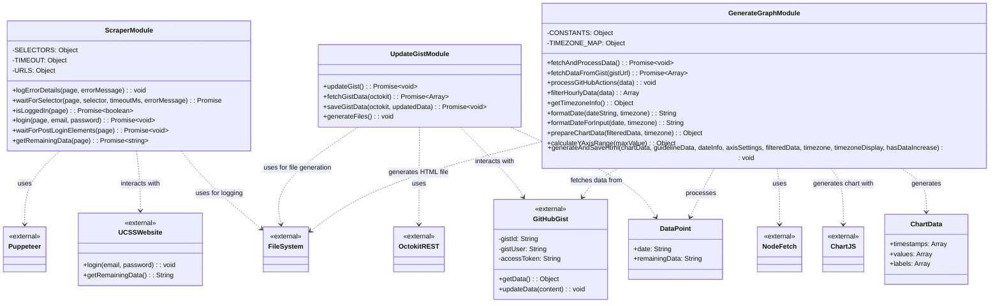

# UCSSMonitorのクラス図

## クラス説明

### ScraperModule (scraper.js)
Puppeteerを使用してUCSSウェブサイトにログインし、残りのデータ通信量を取得します。

### UpdateGistModule (update_gist.js)
OctokitライブラリでGitHubのGistにデータを保存します。ScraperModuleから取得したデータを時系列で記録します。

### GenerateGraphModule (generate_graph.js)
GitHubのGistからデータを取得し、Chart.jsを使用してインタラクティブな使用量グラフを生成します。

### 外部依存関係
- **Puppeteer**: ヘッドレスブラウザ制御ライブラリ
- **OctokitREST**: GitHub API クライアントライブラリ
- **ChartJS**: グラフ描画ライブラリ
- **FileSystem**: ファイル操作用Node.js組み込みモジュール
- **NodeFetch**: HTTPリクエスト用ライブラリ

### データモデル
- **DataPoint**: 日付と残りデータ量のペア
- **ChartData**: グラフ描画用のデータ構造