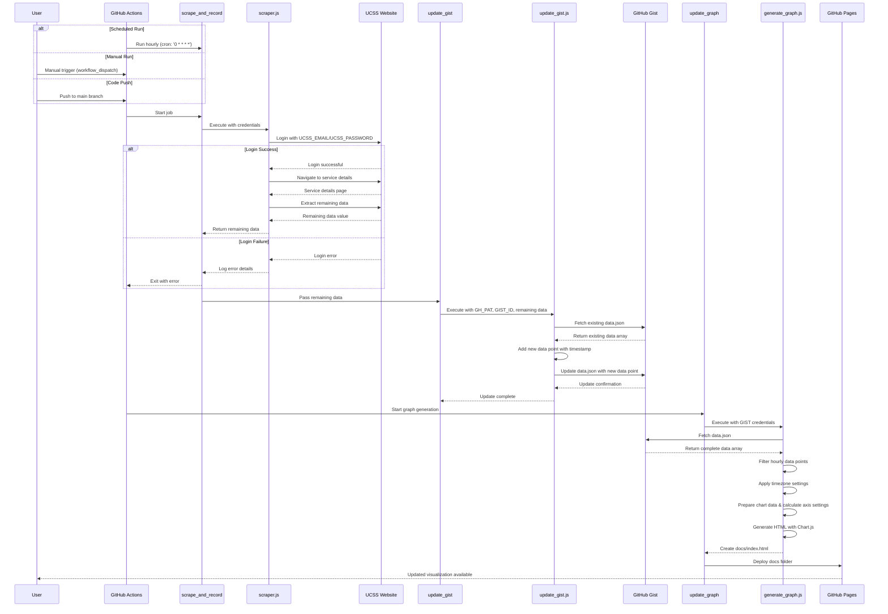

```mermaid
sequenceDiagram
    participant User
    participant GitHubActions as GitHub Actions
    participant ScraperJob as scrape_and_record
    participant Scraper as scraper.js
    participant UndercurrentSS as UCSS Website
    participant GistJob as update_gist
    participant UpdateGist as update_gist.js
    participant GitHubGist as GitHub Gist
    participant GraphJob as update_graph
    participant GenGraph as generate_graph.js
    participant GitHubPages as GitHub Pages

    %% Triggering the workflow
    alt Scheduled Run
        GitHubActions->>ScraperJob: Run hourly (cron: '0 * * * *')
    else Manual Run
        User->>GitHubActions: Manual trigger (workflow_dispatch)
    else Code Push
        User->>GitHubActions: Push to main branch
    end

    %% Scraper job
    GitHubActions->>ScraperJob: Start job
    ScraperJob->>Scraper: Execute with credentials
    Scraper->>UndercurrentSS: Login with UCSS_EMAIL/UCSS_PASSWORD
    alt Login Success
        UndercurrentSS-->>Scraper: Login successful
        Scraper->>UndercurrentSS: Navigate to service details
        UndercurrentSS-->>Scraper: Service details page
        Scraper->>UndercurrentSS: Extract remaining data
        UndercurrentSS-->>Scraper: Remaining data value
        Scraper-->>ScraperJob: Return remaining data
    else Login Failure
        UndercurrentSS-->>Scraper: Login error
        Scraper-->>ScraperJob: Log error details
        ScraperJob-->>GitHubActions: Exit with error
    end

    %% Update Gist job (part of scrape_and_record)
    ScraperJob->>GistJob: Pass remaining data
    GistJob->>UpdateGist: Execute with GH_PAT, GIST_ID, remaining data
    UpdateGist->>GitHubGist: Fetch existing data.json
    GitHubGist-->>UpdateGist: Return existing data array
    UpdateGist->>UpdateGist: Add new data point with timestamp
    UpdateGist->>GitHubGist: Update data.json with new data point
    GitHubGist-->>UpdateGist: Update confirmation
    UpdateGist-->>GistJob: Update complete

    %% Generate graph job
    GitHubActions->>GraphJob: Start graph generation
    GraphJob->>GenGraph: Execute with GIST credentials
    GenGraph->>GitHubGist: Fetch data.json
    GitHubGist-->>GenGraph: Return complete data array
    GenGraph->>GenGraph: Filter hourly data points
    GenGraph->>GenGraph: Apply timezone settings
    GenGraph->>GenGraph: Prepare chart data & calculate axis settings
    GenGraph->>GenGraph: Generate HTML with Chart.js
    GenGraph-->>GraphJob: Create docs/index.html

    %% Deployment
    GraphJob->>GitHubPages: Deploy docs folder
    GitHubPages-->>User: Updated visualization available
```
