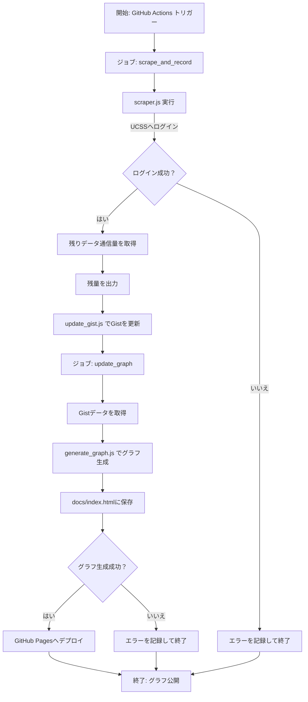

```mermaid
flowchart TD
    A[開始: GitHub Actions トリガー] --> B[ジョブ: scrape_and_record]
    B --> C[scraper.js 実行]
    C -->|UCSSへログイン| D{ログイン成功？}
    D -->|はい| E[残りデータ通信量を取得]
    D -->|いいえ| F[エラーを記録して終了]
    E --> G[残量を出力]
    G --> H[update_gist.js でGistを更新]
    H --> I[ジョブ: update_graph]
    I --> J[Gistデータを取得]
    J --> K[generate_graph.js でグラフ生成]
    K --> L[docs/index.htmlに保存]
    L --> M{グラフ生成成功？}
    M -->|はい| N[GitHub Pagesへデプロイ]
    M -->|いいえ| O[エラーを記録して終了]
    N --> P[終了: グラフ公開]
    F --> P
    O --> P
```