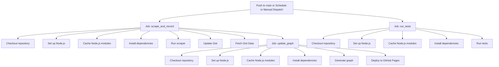

```mermaid
graph TD
    A[Push to main or Schedule or Manual Dispatch] --> B[Job: scrape_and_record]
    B --> B1[Checkout repository]
    B --> B2[Set up Node.js]
    B --> B3[Cache Node.js modules]
    B --> B4[Install dependencies]
    B --> B5[Run scraper]
    B --> B6[Update Gist]
    B --> B7[Fetch Gist Data]
    B --> C[Job: update_graph]
    C --> C1[Checkout repository]
    C --> C2[Set up Node.js]
    C --> C3[Cache Node.js modules]
    C --> C4[Install dependencies]
    C --> C5[Generate graph]
    C --> C6[Deploy to GitHub Pages]
    A --> D[Job: run_tests]
    D --> D1[Checkout repository]
    D --> D2[Set up Node.js]
    D --> D3[Cache Node.js modules]
    D --> D4[Install dependencies]
    D --> D5[Run tests]
```