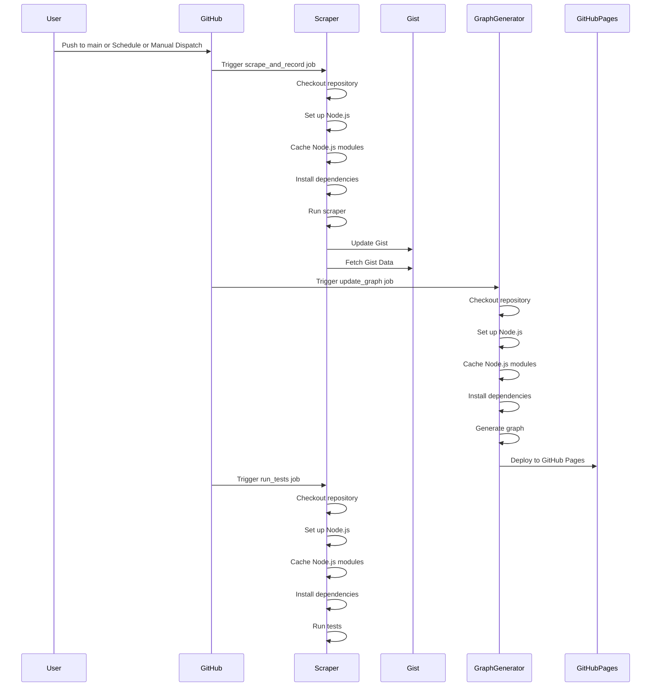

```mermaid
sequenceDiagram
    participant User
    participant GitHub
    participant Scraper
    participant Gist
    participant GraphGenerator
    participant GitHubPages

    User->>GitHub: Push to main or Schedule or Manual Dispatch
    GitHub->>Scraper: Trigger scrape_and_record job
    Scraper->>Scraper: Checkout repository
    Scraper->>Scraper: Set up Node.js
    Scraper->>Scraper: Cache Node.js modules
    Scraper->>Scraper: Install dependencies
    Scraper->>Scraper: Run scraper
    Scraper->>Gist: Update Gist
    Scraper->>Gist: Fetch Gist Data
    GitHub->>GraphGenerator: Trigger update_graph job
    GraphGenerator->>GraphGenerator: Checkout repository
    GraphGenerator->>GraphGenerator: Set up Node.js
    GraphGenerator->>GraphGenerator: Cache Node.js modules
    GraphGenerator->>GraphGenerator: Install dependencies
    GraphGenerator->>GraphGenerator: Generate graph
    GraphGenerator->>GitHubPages: Deploy to GitHub Pages
    GitHub->>Scraper: Trigger run_tests job
    Scraper->>Scraper: Checkout repository
    Scraper->>Scraper: Set up Node.js
    Scraper->>Scraper: Cache Node.js modules
    Scraper->>Scraper: Install dependencies
    Scraper->>Scraper: Run tests
```